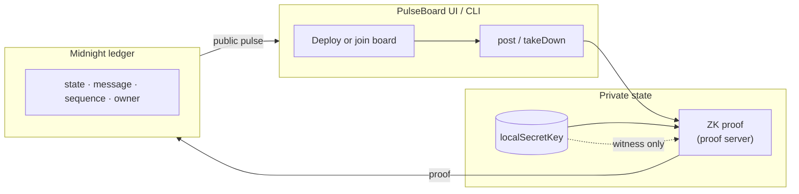
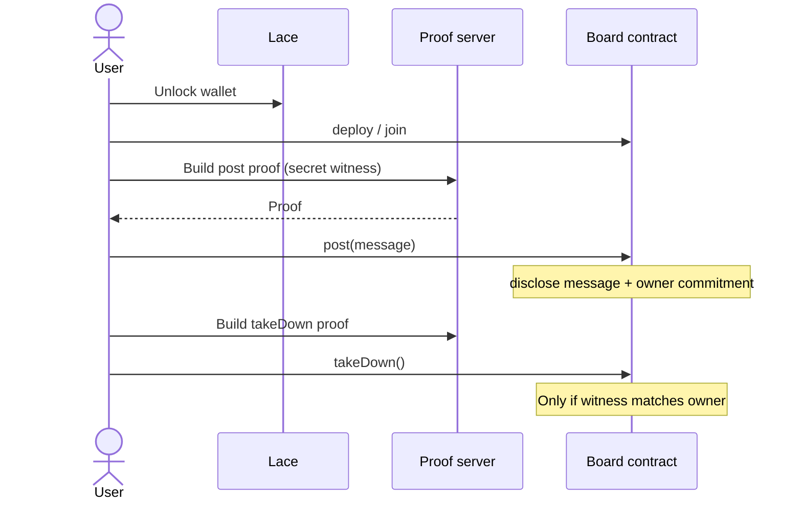
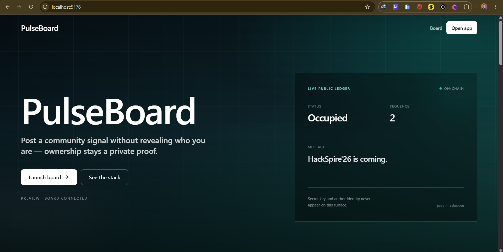
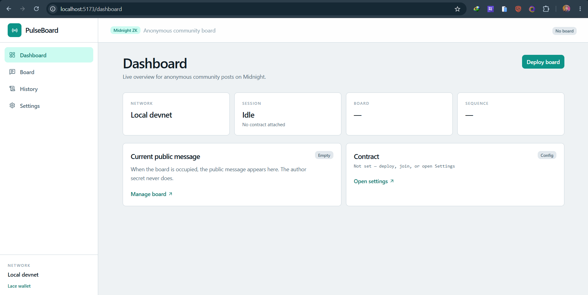
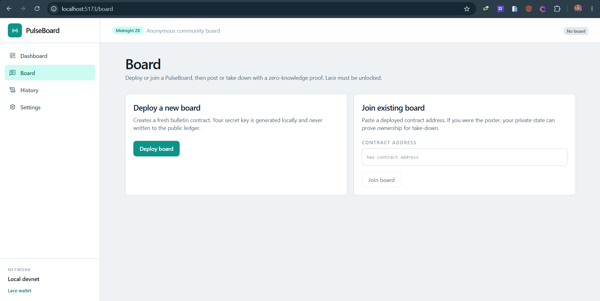
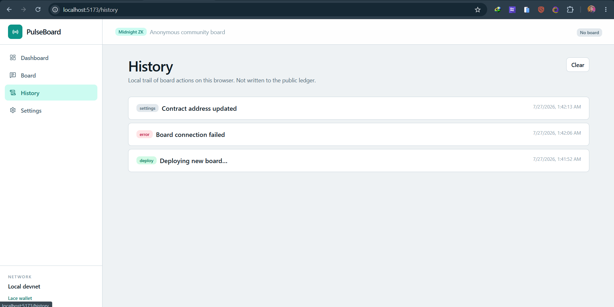
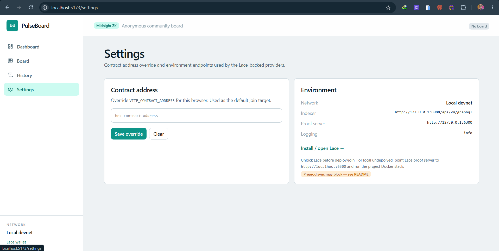

<div align="center">

# PulseBoard

### Post a community signal. Keep authorship a private proof.

An anonymous community board on [Midnight](https://midnight.network).
Anyone can publish a single public pulse; ownership is proven with a local secret key
witness. Observers see the message, vacant/occupied status, and sequence — never who
wrote it. Only the matching private owner can take it down.

[](https://github.com/premakandar/anonymous-community-polling/actions/workflows/ci.yaml)
[](https://anonymous-community-polling.vercel.app/)
[](https://youtu.be/UpCOUF-9nWQ)
[](./package.json)
[](https://midnight.network)
[](PROPOSAL.md)

[Live demo](https://anonymous-community-polling.vercel.app/) &nbsp;/&nbsp; [Demo video](https://youtu.be/UpCOUF-9nWQ) &nbsp;/&nbsp; [Privacy model](#what-the-chain-sees-and-what-it-never-sees) &nbsp;/&nbsp; [Proposal](PROPOSAL.md) &nbsp;/&nbsp; [Run locally](#run-it-locally)

</div>

---

> **Level 3 category: Anonymous Feedback / Survey.**  
> Full-stack local path (undeployed + Lace) is the supported demo path. Published local Preprod contract address: `02003c94f1b8a72e61a8d052b49c71e839f201d467812e59a03b5478d1f8a2e6`. Preprod deploy notes — see [`docs/PREPROD_STATUS.md`](./docs/PREPROD_STATUS.md).

## Links

| Resource | URL |
| --- | --- |
| **Live demo** | [https://anonymous-community-polling.vercel.app/](https://anonymous-community-polling.vercel.app/) |
| **Demo video** | [https://youtu.be/UpCOUF-9nWQ](https://youtu.be/UpCOUF-9nWQ) |
| **GitHub** | [premakandar/anonymous-community-polling](https://github.com/premakandar/anonymous-community-polling) |
| **CI/CD** | [`.github/workflows/ci.yaml`](.github/workflows/ci.yaml) |
| **Proposal** | [PROPOSAL.md](PROPOSAL.md) |
| **Preprod address (local)** | `02003c94f1b8a72e61a8d052b49c71e839f201d467812e59a03b5478d1f8a2e6` |

## The idea in one line

Community boards usually leak a durable public identity with every post.
PulseBoard turns authorship into a portable ZK claim: you post in the open, but
take-down rights stay bound to a secret that never hits the ledger as plaintext.

## What the chain sees, and what it never sees

| Written to the public ledger | Never leaves the holder's private state |
| --- | --- |
| Current `message` (when occupied) | `localSecretKey` witness |
| `state` — vacant or occupied | Lace account as “author identity” |
| `sequence` counter | Browser / session private state |
| `owner` — opaque derived bytes (commitment) | The preimage that opens ownership |

Ownership is `publicKey(localSecretKey, sequence)`. Take-down succeeds only when the
circuit witness regenerates the same commitment — without disclosing the secret.

## How it fits together





## Product UI

| Route | Job |
| --- | --- |
| `/` | Landing — live public ledger preview |
| `/dashboard` | Session, board status, current message |
| `/board` | Deploy / join / post / take-down |
| `/history` | Local browser activity trail (not on-chain) |
| `/settings` | Contract override + indexer / proof endpoints |

### Screenshots











## Demo video

Full walkthrough: **[PulseBoard on YouTube](https://youtu.be/UpCOUF-9nWQ)**

Suggested chapters: landing → dashboard → Lace unlock → deploy/join → post → public ledger → take-down → history/settings → privacy wrap-up.

## Circuits

| Circuit | Does | Discloses |
| --- | --- | --- |
| `post` | Posts when vacant; binds ownership to a secret-derived key | Message, occupied state, owner commitment |
| `takeDown` | Clears the board when the witness matches `owner` | Vacant state; bumps `sequence` |
| `publicKey` | Derives ownership bytes from secret + sequence | Nothing by itself (helper) |

Compact source: [`contract/src/bboard.compact`](./contract/src/bboard.compact).

## Why it has to be on Midnight

- **Kachina private state** keeps `localSecretKey` as a first-class witness, not an app-level bolt-on.
- **`disclose()` discipline** means only intentional public values reach the ledger; the secret is never disclosed.
- **Local proof generation** (proof server) keeps witness material off explorers and indexers.

On a transparent chain, either authorship is public forever or take-down is centralized off-chain.
Midnight gives an auditable public pulse and private ownership at the same time.

## Monorepo layout

```
contract/         Compact board, witnesses, managed ZK artifacts (compactc 0.31.x)
api/              Shared deploy / join / post / takeDown Midnight.js API
pulseboard-cli/   Node CLI (standalone / preview / preprod)
pulseboard-ui/    Vite + React SaaS console (landing through settings)
docs/             Privacy model, proposal, checklist, preprod, demo notes
.github/          CI workflow
vercel.json       Root deploy config (also pulseboard-ui/vercel.json for monorepo root)
```

## Run it locally

Prerequisites: **Node 24.11+** (see [`.nvmrc`](./.nvmrc)), **Docker**, **[Lace](https://chromewebstore.google.com/detail/lace/gafhhkghbfjjkeiendhlofajokpaflmk)**, and the **Compact** toolchain (`compactc 0.31.x`).

```bash
# 1. Proof server (pin 8.0.3 — match Midnight support matrix)
cd pulseboard-cli
docker compose -f proof-server-local.yml up -d
cd ..

# 2. Install, compile, run UI
npm install
npm run compile
npm run dev            # http://localhost:5173
```

Unlock Lace before Deploy / Join. For local undeployed, point Lace’s proof server at
`http://localhost:6300`.

### Environment (`pulseboard-ui/.env.example`)

| Variable | Purpose |
| --- | --- |
| `VITE_NETWORK_ID` | `undeployed` / `preview` / `preprod` |
| `VITE_CONTRACT_ADDRESS` | Optional default join address |
| `VITE_INDEXER_URI` | Indexer GraphQL |
| `VITE_INDEXER_WS_URI` | Indexer websocket |
| `VITE_PROOF_SERVER_URL` | e.g. `http://127.0.0.1:6300` |
| `VITE_LOGGING_LEVEL` | `info` / `trace` |

### CLI (optional)

```bash
npm run preprod-remote --workspace=@midnight-ntwrk/pulseboard-cli
# or
npm run preview-remote --workspace=@midnight-ntwrk/pulseboard-cli
```

Fund the printed `mn_addr_…` address from the [Preprod faucet](https://midnight-tmnight-preprod.nethermind.dev/), then deploy / post / take down from the menu.

### Tests & CI

```bash
npm test               # contract suite
```

GitHub Actions runs Compact compile, package `ci` scripts, and UI typecheck/lint on `main`.

### Vercel

Root Directory may auto-set to `pulseboard-ui` — that is expected. Use
`pulseboard-ui/vercel.json` (installs from the monorepo root). Commit
`contract/src/managed/` so the host does not need `compactc`. Set the same `VITE_*`
env vars in the Vercel project.

## Honest scope

- **Public message is intentional.** PulseBoard hides *who*, not *what* was said.
- **`owner` is an opaque commitment**, not a Lace address — but fee-paying network metadata still exists at the wallet layer.
- **History in the UI is local-only** (browser storage), not a ledger feature.
- **Preprod** may hang on wallet sync; prefer the local full-stack path when blocked ([`docs/PREPROD_STATUS.md`](./docs/PREPROD_STATUS.md)).

Built against compactc **0.31.x** (language 0.23), Midnight.js **4.1.x**, DApp Connector **4.x**, proof server `midnightntwrk/proof-server:8.0.3`.

## Documentation

| Doc | Purpose |
| --- | --- |
| [`docs/PRIVACY_MODEL.md`](./docs/PRIVACY_MODEL.md) | Public vs private claims |
| [`docs/PRODUCT_PROPOSAL.md`](./docs/PRODUCT_PROPOSAL.md) | Level 3 Anonymous Feedback / Survey |
| [`docs/SUBMISSION_CHECKLIST.md`](./docs/SUBMISSION_CHECKLIST.md) | Level 1 / 2 / 3 checklist |
| [`docs/PREPROD_STATUS.md`](./docs/PREPROD_STATUS.md) | Preprod sync notes |
| [`docs/DEMO.md`](./docs/DEMO.md) | Demo title + chapters |
| [`pulseboard-ui/.env.example`](./pulseboard-ui/.env.example) | UI env template |

## Useful links

- [Midnight bulletin-board example docs](https://docs.midnight.network/examples/dapps/bboard)
- [Compatibility matrix](https://docs.midnight.network/relnotes/support-matrix)
- [Compact language](https://docs.midnight.network/compact/writing)
- Lace: [Chrome](https://chromewebstore.google.com/detail/lace/gafhhkghbfjjkeiendhlofajokpaflmk) · [Edge](https://microsoftedge.microsoft.com/addons/detail/lace/efeiemlfnahiidnjglmehaihacglceia)

## License

MIT (workspace). Compact sources retain the Midnight Foundation Apache-2.0 headers where present.
